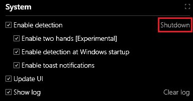

# Gestures Service

The Gestures Service provides [gesture](index.md###gesture) detection as a local service for client applications. For example, our demo applications, provided with the Project Prague installation - [DiscoveryClient](https://aka.ms/gestures/docs), [Gestures Camera](https://aka.ms/gestures/docs) and [Wolfly](https://aka.ms/gestures/docs) - are all relying on the Gestures Service for [gesture](index.md###gesture) detection. You can use the [GesturesServiceEndpoint](xref:Microsoft.Gestures.Endpoint.GesturesServiceEndpoint) class from the [Project Prague API](https://docs.microsoft.com/en-us/dotnet/api/microsoft.gestures) in order to communicate with the Gestures Service from your application.

After you install Project Prague, the Gestures Service will be launched every time your machine starts. For further details on installation, refer to [Setting up Project Prague on your machine](index.md###setting-up-project-prague-on-your-machine).

## Gestures Service UI

Note that the Gestures Service has a UI (user interface) displaying information about [gesture](index.md###gesture) and pose detection in real-time. The "Microsoft Gestures Service" window, depicted below, contains this UI:

### Running and terminating the Gestures Service

To hide the Gestures Service UI simply close the "Microsoft Gestures Service" window. Note that closing the UI will not terminate the Gestures Service process, i.e. - [gesture](index.md###gesture) detection will continue to be available. To display the Gestures Service UI again, after it has been closed, double-click the "Microsoft.Gestures.Service" shortcut which has been created on your desktop during Project Prague installation.

To shut terminate the Gestures Service entirely, bring the "Microsoft Gestures Service" window to the foreground and click on the "Shutdown" link, illustrated below:

### Gestures Service UI features

In this section, we will cover the various sub-regions of the Gestures Service UI.

Note that every sub-region has a maximization button in the top right corner: 

By clicking this button you can extend the sub-region to occupy the entire area of the "Microsoft Gestures Service" window.

#### System sub-region

The System sub-region is the command-and-control part of the Gestures Service UI:

This sub-region is divided into two halves: The upper half contains check-boxes that toggle different features of the Gestures Service and the lower half contains a graph illustrating relevant performance metrics as they evolve over time.

The check-boxes and their corresponding functionality are listed in the following table:

Check-box     | Functionality
------------ | ------------
Enable detection | Halt or resume the Gestures Service
Enable detection at Windows Startup | Specify whether the Gestures Service will be launched next time Windows starts
Enable toast notifications | Specify whether the Gestures Service will display toast notifications
Update UI | Halt or resume Gestures Service UI (halt to save machine resources)
Show log | Toggle the visibility of the log sub-region in the Gestures Service UI

Note that when the "Show log" check-box is enabled, you can clear the log of its contents by hitting the "Clear log" link:

The graph in the lower half of the System sub-region depicts

- FPS - momentary frame rate, in units of frames-per-second.
- CPU - momentary processing resources consumption, in units of percentage from the total available processing power.
- Memory - total momentary RAM (random access memory) consumption, in units of megabytes.

The FPS and CPU metrics are computed and displayed for both the "Workflow" and the "UI" threads. The "Workflow" thread is our main worker thread. You can control which metrics are plotted in the graph by toggling the check-boxes placed beneath it.

#### Image sub-region

This sub-region of the Gestures Service UI displays the IR video stream produced by the depth camera. As you can see, we filter out all the pixels in the frame which are outside of a rectangle containing the hand:

On top of the IR frame, We draw vectors indicating the estimated direction of each finger and location of each fingertip. We also draw a local coordinate system, positioned at the [palm center](xref:Microsoft.Gestures.Skeleton.I​Hand​Skeleton.​Palm​Position), made up of the following axes

- Blue - the direction perpendicular to the palm plane. In our API, we refer to this axis as the [palm direction](xref::Microsoft.Gestures.Skeleton.I​Hand​Skeleton.​Palm​Direction).
- Green - the direction that would be aligned with the middle finger had it been stretched out. In our API, we refer to this axis as the [palm orientation](xref::Microsoft.Gestures.Skeleton.I​Hand​Skeleton.​Palm​Orientation).
- Red - the cross product of the palm direction (blue) and palm orientation (green) axes.

#### Clients sub-region

This sub-region displays a list of clients connected to the gestures service:

In the above example there is only a single client and the information displayed is:

- The client’s process name - Microsoft.Gestures.DiscoveryClient in our example.
- The client's process Id - 7908 in our example.
- The API version of the client's [GesturesServiceEndpoint](xref:Microsoft.Gestures.Endpoint.GesturesServiceEndpoint) - 1.0.17190.3 in our example.
- An indication whether the client is receiving a skeleton stream - our client is *Receiving Skeleton Stream*.
- A list of all gestures that the client has registered with the service - "Shell_MuteToggle", "Discovery_Tray" and "Shell_Start" in the example.

 #### Gesture Detection sub-region

The Gesture Detection sub-region depicts the detection history of all registered [gestures](index.md###gesture). Recall that every [gesture](index.md###gesture) is represented as a state-machine. A correct execution of a given [gesture](index.md###gesture) corresponds to a sequence of states in its state-machine, such that the first state in the sequence is an initial state and the final state is a receiving state.

Following is a snapshot of the Gesture Detection sub-region. Each line corresponds to a different gesture that was registered at some point in time. The first column, Gesture, lists all the gestures that were registered over time. The second column, Timeline, displays the history of the gesture detection state. The third column, Current, displays the current state of the gesture state-machine.

A disambiguation for the symbols displayed in the Gesture Detection sub-region:

- Red square - the gesture is not currently active (the application which registered is not the foreground application).
- Green triangle - the gesture is active.
- Blue circle - the segment of the gesture has been detected and the state-machine advanced to the corresponding state.
- White Vulcan salute - the gesture detection completed successfully.

#### Log sub-region

The Log sub-region displays messages recorded by the Gestures Service in real-time. You will find here various information about the internal state of the Gestures Service process. When the Gestures Service is not behaving as expected, try looking for an indication of an error in the log. Contact [gestures@microsoft.com](gestures@microsoft.com) for support in case you can't figure solve the problem.

Here is an example snapshot of the Log sub-region:

Please note that our log is not persisted to your hard disk drive.