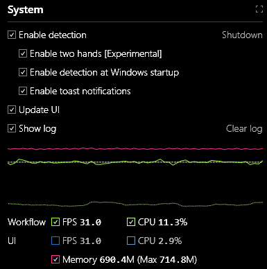
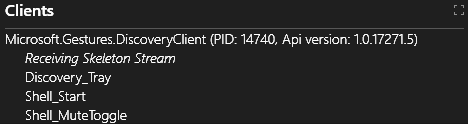

# Gestures Service

**The Gestures Service provides gesture detection as a local service for client applications**. For example, the demo applications provided with Project Prague - [DiscoveryClient](https://aka.ms/gestures/docs), [Gestures Camera](https://aka.ms/gestures/docs) and [Wolfly](https://aka.ms/gestures/docs) - all rely on the **Gestures Service** for their gesture detection. You can **use the [GesturesServiceEndpoint](http://aka.ms/gestures) class in order to communicate with the Gestures Service** from your application.

After you [install Project Prague](index.md#setting-up-project-prague-on-your-machine), **the Gestures Service will be launched every time your machine starts**. To disable this, uncheck the **Enable detection at Windows startup** checkbox in the **System** section of the **Gestures Service UI** (user interface) window.

## Gestures Service UI

The **Gestures Service** has a UI displaying information about [gesture](index.md#gesture) and [pose](index.md#hand-pose) detection in real-time. This UI is the **Microsoft Gestures Service** window, as displayed below:

### Running and terminating the Gestures Service

**To hide the Gestures Service UI simply close the Microsoft Gestures Service** window using the **X** button on the top right corner. Note that closing the UI will not terminate the **Gestures Service** process, i.e. - gesture detection will continue being available. To display the **Gestures Service UI** again, after it has been closed, double-click the **Microsoft.Gestures.Service** on your desktop.

**To terminate the Gestures Service process click on the "Shutdown" link** in the **System** section of the Gestures Service UI:

### Gestures Service UI features

We will now cover in detail the various sections of the Gestures Service UI.

Note that every section has a **maximization button** in its top right corner, allowing you to **extend the section to occupy the full extent of the Gestures Service UI window**:

#### System section

**The System section is the command-and-control center** of the **Gestures Service UI**:

This section is divided into two parts: The upper part contains checkboxes to control different features of the **Gestures Service** and the lower part illustrates relevant performance metrics as they evolve over time.

The checkboxes and their corresponding functionality are listed in the following table:

checkbox     | Functionality
------------- | ------------
**Enable detection** | Halt or resume the **Gestures Service**
**Enable detection at Windows Startup** | Specify whether the **Gestures Service** will be launched next time Windows starts
**Enable toast notifications** | Specify whether the **Gestures Service** will display toast notifications
**Update UI** | Halt or resume the **Gestures Service UI**
**Show log** | Toggle the visibility of the log section in the **Gestures Service UI**

Note that when the **Show log** checkbox is enabled, you can clear the log of its contents by pressing the **Clear log** link.

The graph in the lower part of the **System** section depicts

- **FPS** - momentary frame rate, in units of frames-per-second.
- **CPU** - momentary processing resource consumption, in percents of the total available processing power.
- **Memory** - total momentary RAM (random access memory) consumption, in units of megabytes.

The **FPS** and **CPU** metrics are computed and displayed for both the **Workflow** and the **UI** threads. The **Workflow** thread is our main worker thread.

You can control which metrics are plotted in the graph by toggling the checkboxes at the bottom of the **System** section.

#### Image section

This section of the **Gestures Service UI** displays the IR video stream produced by the [depth camera](index.md#supported-depth-cameras). As you can see, we filter and display only the pixels which belong to a rectangle around the hand:

On top of the IR frame, **We draw vectors indicating the estimated direction of each finger and location of each fingertip**. We also draw a local coordinate system, positioned at the [palm center](http://aka.ms/gestures), made up of the following axes:

- **Blue** - the direction **perpendicular to the palm plane**. In our API, we refer to this axis as the [palm direction](http://aka.ms/gestures).
- **Green** - the direction that would be **aligned with the middle finger had it been stretched out**. In our API, we refer to this axis as the [palm orientation](http://aka.ms/gestures).
- **Red** - **the cross product of the palm direction (blue) and palm orientation (green)** axes.

#### Clients section

This section displays the list of clients connected to the **Gestures Service**:

In the above example there is only a single client and the following information is displayed for it:

- The client’s **process name** - Microsoft.Gestures.DiscoveryClient in our example.
- The client's **process Id** - 14740 in our example.
- The **API version of the client's [GesturesServiceEndpoint](http://aka.ms/gestures)** - 1.0.17271.5 in our example.
- An indication whether the client **is receiving a skeleton stream** - our client is *Receiving Skeleton Stream*.
- **A list of all the gestures that the client has registered** with the service - "Shell_MuteToggle", "Discovery_Tray" and "Shell_Start" in the example.

#### Gesture Detection section

**The Gesture Detection section depicts the detection history of all registered gestures**. Recall that [every gesture is represented as a state-machine](index.md#gesture). A correct execution of a given gesture corresponds to a sequence of states in its state-machine, such that the first state in the sequence is an initial state and the final state is a receiving state.

Following is a snapshot of the Gesture Detection section. Each line corresponds to a different gesture that was registered at some point in time. The highlighted lines at the top correspond to gestures currently registered and the grayed out lines at the bottom correspond to gestures that were registered in the recent past.

There are three columns in the **Gesture Detection** section of the UI:

- **Gesture** - displays the gesture name and its state
  -  indicate the gesture is currently registered
  -  indicates the gesture is not currently registered
- **TimeLine** - displays the history of events associated with the corresponding gesture
  -  indicate a gesture registration event
  -  indicates a gesture de-registration event
  -  indicates that the gesture state-machine advanced due to detection of a [gesture segment](https://docs.microsoft.com/en-us/dotnet/api/microsoft.gestures.gesturesegment) (state)
  -  indicates that a gesture was detected
- **Current** - specifies the name of the current [gesture segment](https://docs.microsoft.com/en-us/dotnet/api/microsoft.gestures.gesturesegment) (state) within the gesture 

#### Log section

The Log section displays a stream of messages produced by the **Gestures Service** in real-time. You will find here various **information about the internal state of the Gestures Service process**. When the **Gestures Service** is not behaving as expected, try looking for an indication of an error in the log. **Contact [gestures@microsoft.com](http://aka.ms/gestures) for support** in case you can't resolve the problem on your own.

Here is an example snapshot of the **Log** section:

Please note that our log is not persisted to your hard disk drive.