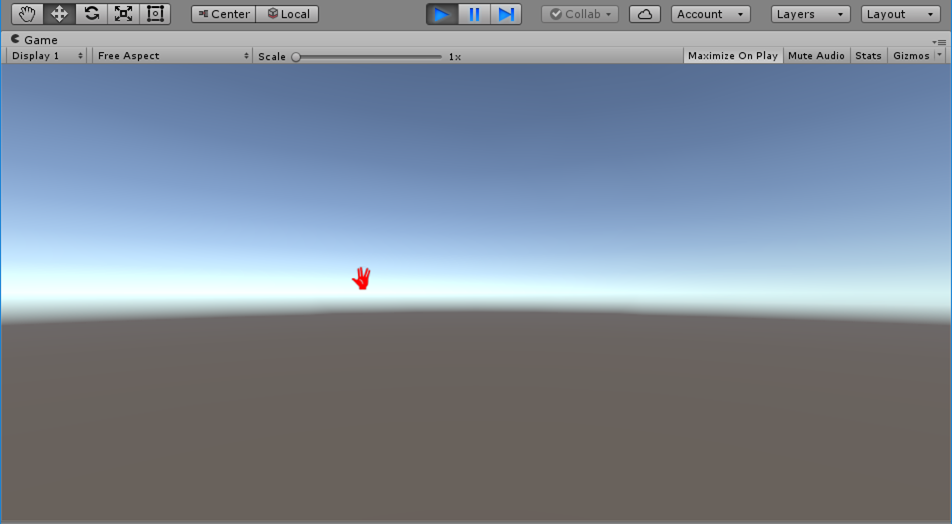

# 3D Object Manipulation - Scene Preparation

This tutorial serves as a preparation for the [**3D Object Manipulation**](unity-tutorials-3d-object-manipulation-hand.md) tutorial. In this tutorial, we will use existing Unity features to create a mouse-controlled cursor capable of moving objects in the 3D scene. In the [**3D Object Manipulation**](unity-tutorials-3d-object-manipulation-hand.md) tutorial, we will replace the mouse input device for hand gestures and motions.

If you wish to focus only on learning how to use gestures with Unity, feel free to skip ahead to the [**3D Object Manipulation**](unity-tutorials-3d-object-manipulation-hand.md) tutorial.

This tutorial will take approximately 30 minutes to complete.

## Download the Final Result

The final Unity project obtained in this tutorial can be found in our open-source samples repository on [GitHub](https://github.com/Microsoft/Gestures-Samples). After you clone the repository, follow these steps to run the application:

1. Launch Unity, in the **Projects** tab select **Open**.
1. Browse to the [**Unity\Tutorials\3D Object Manipulation - Scene Preparation**](https://github.com/Microsoft/Gestures-Samples/tree/master/Unity/3D%20Object%20Manipulation%20-%20Scene%20Preparation) directory within the cloned repository.
1. Press the play button (or **Ctrl+P**) to run the scene.

## Prerequisites

This tutorial assumes you have basic familiarity with the C# programming language and some experience with the Unity environment. We assume you know how to create Unity projects, scenes, game objects and scripts.

We recommend that you complete the [**Introduction**](unity-tutorials-introduction.md) tutorial before starting this tutorial.

## Step 1 - Create the Cursor Game Object

1. If you've completed the [introduction tutorial](unity-tutorials-introduction.md), open the project you've created in that tutorial and press **Ctrl+N** to create a new scene. Otherwise, create a new Unity project and import the [Project Prague toolkit for Unity](https://github.com/Microsoft/Gestures-Samples/blob/master/Unity/Microsoft.Gestures.Toolkit.unitypackage) (refer to [step 1 in the introduction tutorial](unity-tutorials-introduction.md#step-1---create-and-configure-a-new-unity-project) for instructions).

1. Press **Ctrl+S** to save the scene, naming it **3D Object Manipulation**.

1. Create an empty game object and name it **Cursor**. Create a corresponding C# script with the same name. To associate the game object with the script, go to the game object's **Inspector** view and drag the script to the blank area below the **Add Component** button (refer to [step 3 in the introduction tutorial](unity-tutorials-introduction.md#step-3---creating-a-script-to-generate-3d-primitives-in-the-scene) to read about associating a script with a game object).

1. Open the **Cursor** script in Visual Studio (double click the script icon in the **Project** window) and replace its contents with the following code:

    [!code-csharp[Cursor](CodeSnippets\Cursor.cs)]

    As you can see, none of the **Cursor** methods are implemented. For now, they contain place-holders and comments.

1. To make the cursor follow the mouse pointer, replace the **GetCursorScreenPosition()** method in **Cursor.cs** with the following contents:

    [!code-csharp[GetCursorPosition](CodeSnippets\GetCursorPosition.cs)]

    To draw the cursor in the correct position every time the screen is refreshed, replace the contents of **OnGUI()** method in **Cursor.cs** with:

    [!code-csharp[OnGui](CodeSnippets\OnGui.cs)]

1. We will use the **PragueCursor.png** texture, provided with the [Project Prague toolkit for Unity](https://github.com/Microsoft/Gestures-Samples/blob/master/Unity/Microsoft.Gestures.Toolkit.unitypackage), as our cursor image. Select the **Cursor** game object in the **Hierarchy** window, locate the **PragueCursor.png** under **MicrosoftGesturesToolkit/Textures** in the **Project** window and drag-and-drop it to the **Cursor Image** box in the **Inspector** window:

    

1. Play the scene now. Whenever the mouse pointer is within the scene borders, you will see a red cursor following it:

    

## Step 2 - Highlight Object under Cursor

We would like to use our cursor to move objects in the scene. In order to recognize which object is currently under the cursor, we will highlight that object's outline.

1. Start by filling the scene with several primitive objects. For convenience, we recommend you attain the viewpoint of the the **Main Camera** before adding any new primitives to the scene: Select the **Main Camera** in the **Hierarchy** window, go to the **GameObject** menu and select **Align View to Selected**.

    To instantiate new primitives, go to the **GameObject** menu again, select **3D Object** and pick one of the primitives in the sub-menu (**Cube**, **Sphere**, etc.). Repeat this process several times, moving each new primitive to a different location in the scene:

    

    > [!TIP]
    > To move an object, click on it, press **w** and then drag it using the [**Move** gizmo](https://docs.unity3d.com/Manual/PositioningGameObjects.html#move).

1. Add a private member to the **Cursor** class. We will use this member to store the game object currently under the cursor. We will refer to this object as "the hovered object":

    [!code-csharp[HoveredGameObject](CodeSnippets\HoveredGameObject.cs)]

    Also add the following public members. We will soon be using them to implement the highlighting feature.

    [!code-csharp[HovePublicMembers](CodeSnippets\HoverPublicMembers.cs)]

    To identify which object is currently under the cursor, replace the contents of the **GetHoveredObject()** method with the following implementation:

    [!code-csharp[GetHoveredObject](CodeSnippets\GetHoveredObject.cs)]

    To highlight the hovered object, replace the contents of **Update()** with the following:

    [!code-csharp[Update](CodeSnippets\Update.cs)]

    Save all changes to the **Cursor.cs** script.

1. Select the **Cursor** game object in the **Hierarchy** window. Locate the **OuterGlow.mat** material under **MicrosoftGesturesToolkit/Materials** in the **Project** window. Drag and drop **OuterGlow.mat** into the **Highlight Material** box in the **Inspector** window:

    

1. Play the scene and move the cursor across the screen. Every time an object is under the cursor, its outline will glow with a bluish aura:

    

## Step 3 - Move Highlighted Object

On this step we will enable our cursor to "grab" an object and move it in space.

1. In the **Cursor.cs** script, prepare the following private members:

    [!code-csharp[Object Grabbing - private members](CodeSnippets\ObjectGrabbingPrivateMembers.cs)]

    And the following public Member:

    [!code-csharp[Object gerabbing - private members](CodeSnippets\ObjectGrabbingPublicMember.cs)]

1. Replace the **OnGUI()** method contents with the following:

    [!code-csharp[Object grabbing - change cursor color](CodeSnippets\ObjectGrabbingChangeCursorColor.cs)]

    This will cause the cursor to change color to **GrabCursorTint** when it enters "grab mode".

1. We are now ready to implement the **StartGrab()** and **StopGrab()** methods:

    [!code-csharp[Start and stop grab](CodeSnippets\StartAndStopGrab.cs)]

1. In the **Update()** method, we would like to add the following functionality:

    - Enter (leave) grab mode whenever the left mouse button is pressed (released) while an object is being hovered.
    - When in grab mode - the hovered object should follow the cursor.

    To achieve this, modify the **Update()** method as follows:

    [!code-csharp[Update method - grab related code](CodeSnippets\UpdateGrab.cs)]

1. Run the scene now, hover over an object and move it by pressing the left mouse button and dragging. Note that the color of the cursor changes when you enter grab mode:

    

1. We will use the scroll wheel to control the movement of the grabbed object in the depth dimension.

    Replace the contents of **GetCursorDistanceScalingFactor()** with the following:

    [!code-csharp[GetCursorDistanceScalingFactor() method](CodeSnippets\GetCursorDistanceScalingFactor.cs)]

1. Try running the scene now. You should be able to move the grabbed object in all three dimensions, using the scroll wheel to move it in the radial direction - to or away from the camera.